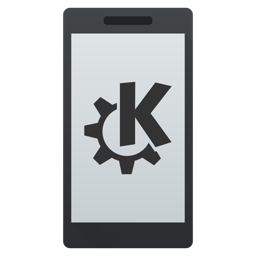
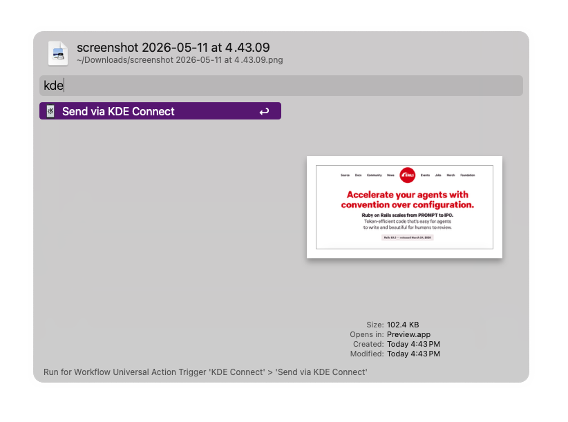
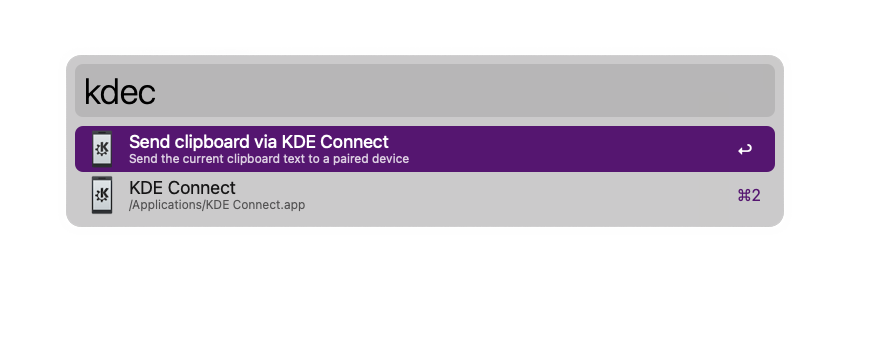

<div align="center">

# KDE Connect Alfred Workflow

**Send text, files, URL's or the clipboard to paired KDE Connect devices.**


</div>

## Usage

Invoke Alfred's Universal Action (default `⌥⌘\`), and pick "Send via KDE Connect".



Send the current clipboard via the `kdec` keyword:



If exactly one device is reachable it receives the payload immediately; otherwise Alfred shows a chooser.

## Requirements

- macOS with [Alfred 5](https://www.alfredapp.com) and the Powerpack.
- [KDE Connect for macOS](https://kdeconnect.kde.org) installed in `/Applications`.
- A paired device on the same network.

## Install

Grab the latest `KDE-Connect.alfredworkflow` from the
[Releases](https://github.com/leonvogt/kde-connect-alfred-workflow/releases) page
and double-click it.

## Configuration

Open the workflow in Alfred preferences and click **Configure Workflow…** to
change the keyword or the path to `kdeconnect-cli`.

## Development

```sh
make link      # symlink workflow/ into Alfred for live editing
make unlink    # remove the symlink
make package   # build dist/KDE-Connect.alfredworkflow
make clean     # remove dist/
```

## License

This project is available as open source under the terms of the [MIT License](https://github.com/leonvogt/kde-connect-alfred-workflow/blob/main/MIT-LICENSE).
